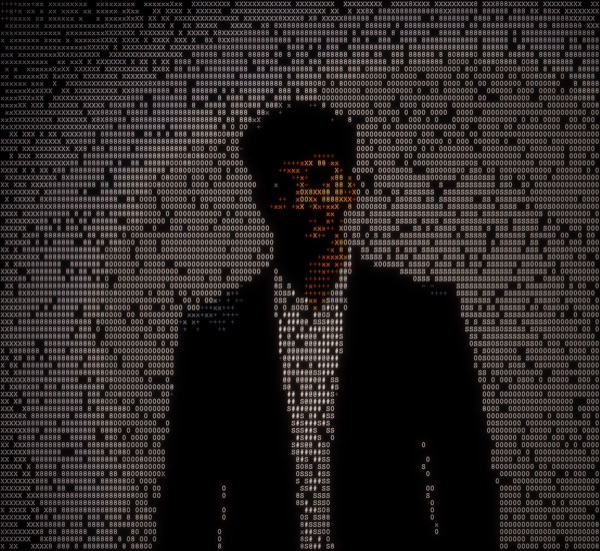

<table>
<tr>
<td width="240" valign="top">
  
</td>
<td valign="top">

# Kushal Varma Gangaraju

**Master's Student in Computer Science, University of Rochester**

I design and deploy scalable machine learning systems across medical imaging, generative modeling, and cloud-native data pipelines. My work spans research-grade modeling, GPU-accelerated training, and production-ready architectures.

[gangarajukushalvarma@gmail.com](mailto:gangarajukushalvarma@gmail.com) · [LinkedIn](https://www.linkedin.com/in/kushal-g-7b9526224) · [Website](https://kushalgangaraju.com)

</td>
</tr>
</table>

---

## Research & Engineering Focus

- Medical Image Segmentation and Classification
- Generative Modeling
- LLM's and RAG
- Transformer-based Architectures and Representation Learning
- Scalable ML Pipelines and Cloud Infrastructure

## Tech Stack

  
  
  
  
   
  
  
  
   
  
  
  

## Current Interests

Scalable generative modeling, retrieval-augmented systems, and quantitative machine learning applications.
